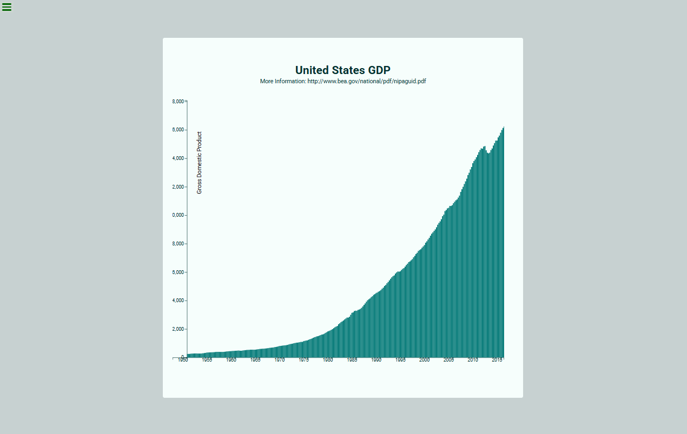

# D3.js Bar Chart

App construído para um módulo do curso Front End Libraries do freeCodeCamp.

### Funcionalidades:

-   Responsivo.
-   Busca de dados de uma API.
-   Exibe dados detalhados no tooltip quando uma barra recebe o hover.

## Uso

Opcionalmente, você não precisa instalar. Pode ir à uma versão simplificada no CodePen: https://codepen.io/maykopr/pen/mdgZmXE

Mas caso prefira baixar, basta abrir o arquivo index.html no navegador.

## Construído com D3.js e mais:

## Autor

[Mayko Costa](https://github.com/Maykopr)

## Licensa

This project is licensed under the MIT licence
